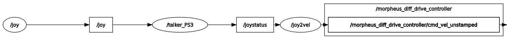

## Joystick package

This ROS2 package is part of the Morpheus project developed by a team at the University of Padua.

It has been developed on **ROS2 Humble distro**.

The purpose of this package is to obtain information from a joystick controller connected via USB and to publish a topic in ROS2 with the bare minimum information needed to move Morpheus rover.

Only PS3 and XBOX360 controllers are supported.

### Package Structure

The `joystick` folder contains the core of the package:

- `config.py`: Used to share the index of movement values of the rover in a `Float32Multiarray` message.
- `talker_360.py`: Parses the `Float32Multiarray` message in the `/joy` topic from an XBOX 360 controller, extracts the required information, and generates a message in the `/joystatus` topic based on the `config.py` file.
- `talker_PS3.py`: Parses the `Float32Multiarray` message in the `/joy` topic from a PS3 controller, extracts the required information, and generates a message in the `/joystatus` topic based on the `config.py` file.
- `joy2cmdvel.py`: Listens to the messages published in the `/joystatus` topic and, based on the movement configured in `config.py`, generates a `Twist_unstamped` message in the `/morpheus_diff_drive_controller/cmd_vel_unstamped` topic. <br>
    The latter topic is the one that is input to the controller defined in the `morpheus_gazebo` package in the Morpheus project repository.

### Launch Files

The package provides two launch files:

- `joystick_360.launch.py`
- `joystick_PS3.launch.py`

Both launch files launch a node from the `joy` package of ROS2 that looks for a controller connected in `/dev/input/js0`.
Then, a specific node for PS3 or XBOX 360 controller is launched, and finally, a `joy2cmdvel` node is launched.

### Prerequisites

Make sure to have installed the following packages for your ROS2 distro:
- `joy`
- `std_msgs`
- `geometry_msgs`

To install those packages, use the following commands:
```bash
sudo apt-get install ros-humble-std-msgs
sudo apt-get install ros-humble-geometry-msgs
sudo apt-get install ros-humble-joy
```

### Getting Started

Some basic knowledge is required to install the package.<br>
Please ensure you have understood some basic ROS2 tutorials and concepts available at [ROS2 Concepts](https://docs.ros.org/en/humble/Concepts.html).

Steps to install the package:
1. Clone this repository in a workspace.
2. Install the repository (`colcon build`).
3. Launch one of the two launch files with the command:<br>
    ```ros2 launch joystick joystick_PS3.launch.py ```<br>
    or<br>
    `ros2 launch joystick joystick_360.launch.py `
4. Connect the controller and follow the instructions published from the nodes.
5. Check the results by opening another terminal and using the command:<br>
    ```ros2 topic echo /morpheus_diff_drive_controller/cmd_vel_unstamped```

### Example of topics chain


### License

This project is licensed under the Apache-2.0 License. See the `LICENSE` file for details.